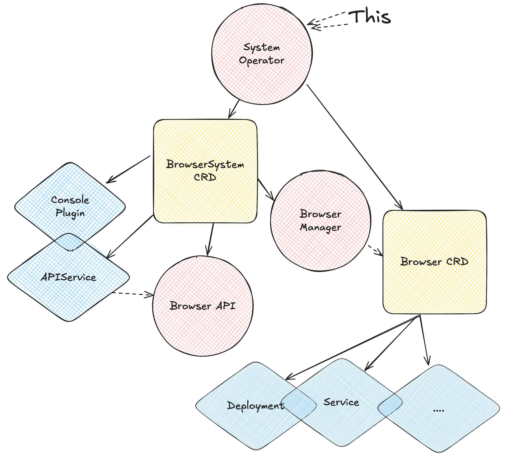

# KubeBrowser System Operator

Operator for configuring and managing Kubebrowser resources.


## Overview

- This operator integrates a full web-browsing capability directly into your cluster.
- It introduces a `Browser` custom resource that deploys a Chromium browser inside a pod.
- A built-in console plugin provides a page with VNC access to the browser, letting you browse the web directly from within your cluster environment.
- A sidecar REST API allows programmatic remote control of the browser.
- Without this operator, testing a service typically required creating a `Route`, exec’ing into another pod and running `curl`, or setting up a port-forward. Now you can simply open a browser from inside the cluster.


## Purpose

The Browser Operator makes it easy to:

- Test services from within the cluster
- Validate network connectivity across namespaces
- Verify access to external services
- Debug routing, DNS, and access issues directly from the cluster’s perspective


## Components

- System Operator (this) (under [./pkg/system-manager](./pkg/system-manager))
- Browser Operator (under [./pkg/browser-manager](./pkg/browser-manager))
- Browser API (under [./pkg/browser-api](./pkg/browser-api))
- Browser Server (at [browser-server repo](https://github.com/kubebrowser/browser-server))
- Console Plugin (at [console-plugin repo](https://github.com/kubebrowser/console-plugin))

## Schema



## Platform

Here are the platforms currently supported:

- OpenShift 4.19+ Only


## Running

To run this locally

```bash
make install run 
```


To deploy locally

```bash
make deploy
```


## Contributing

You can contribute by:

- Raising any issues you find using the Operator
- Submitting a patch or opening a PR
- Requesting changes or features


## Licensing

This software and its components are licensed under the [Apache 2.0 license](https://www.apache.org/licenses/LICENSE-2.0).
